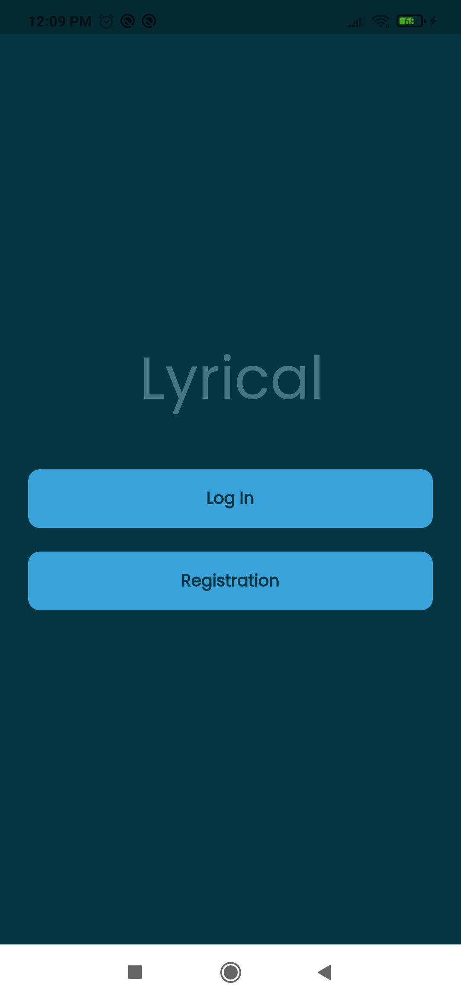
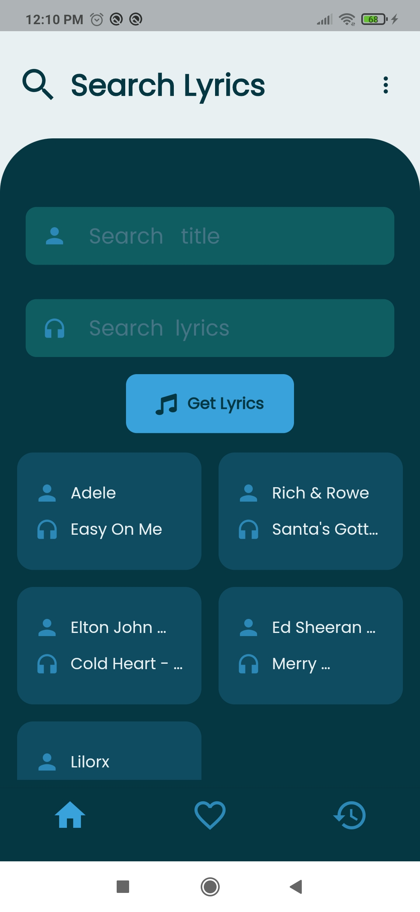
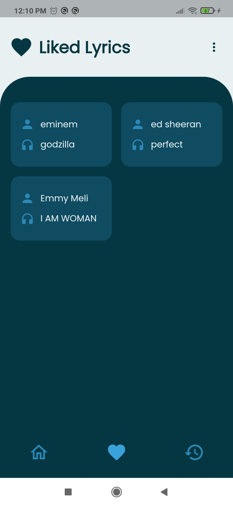
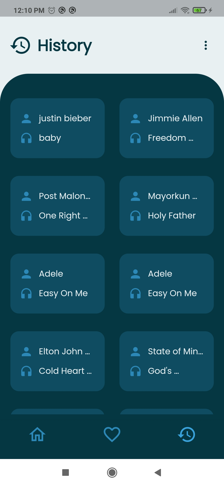

# lyrical

A flutter app that use MusicMatch,Lyricsovh API and has a Firebase Backend,In this app first of all user Register with email and password then user can search any lyrics with(title or lyrics name).You can add any lyrics and access,your history is store.

# Technology

Lyrical is a app build with the following

- [Dart](https://dart.dev/guides)
- [Flutter](https://flutter.dev/)
- [Firebase](https://firebase.google.com/docs?gclsrc=ds&gclsrc=ds&gclid=CO2hw6mJ0fQCFRN1jgodSxgMEw)
- [MusicMatch API](https://developer.musixmatch.com/)
- [lyrics.ovh API](https://lyricsovh.docs.apiary.io/#)

# Preview of project

   

## Get Started

### Prerequisites

You need to have **Flutter SDK** installed , if not install it from [here](https://flutter.dev/docs/get-started/install)

### Installing

Clone this repository, open it in an IDE and in the root directory run :

`flutter pub get`

then connect your emulator/simulator/physical device and run :

`flutter run`

 

## Documentation

For help getting started with Flutter, view online [documentation](https://flutter.dev/docs)

 

## Contributing

Contributions are always welcome!

Contact [anuprajvarma](https://github.com/anuprajvarma) for any guidance

#### Show some :heart: love and :star: star this repository
